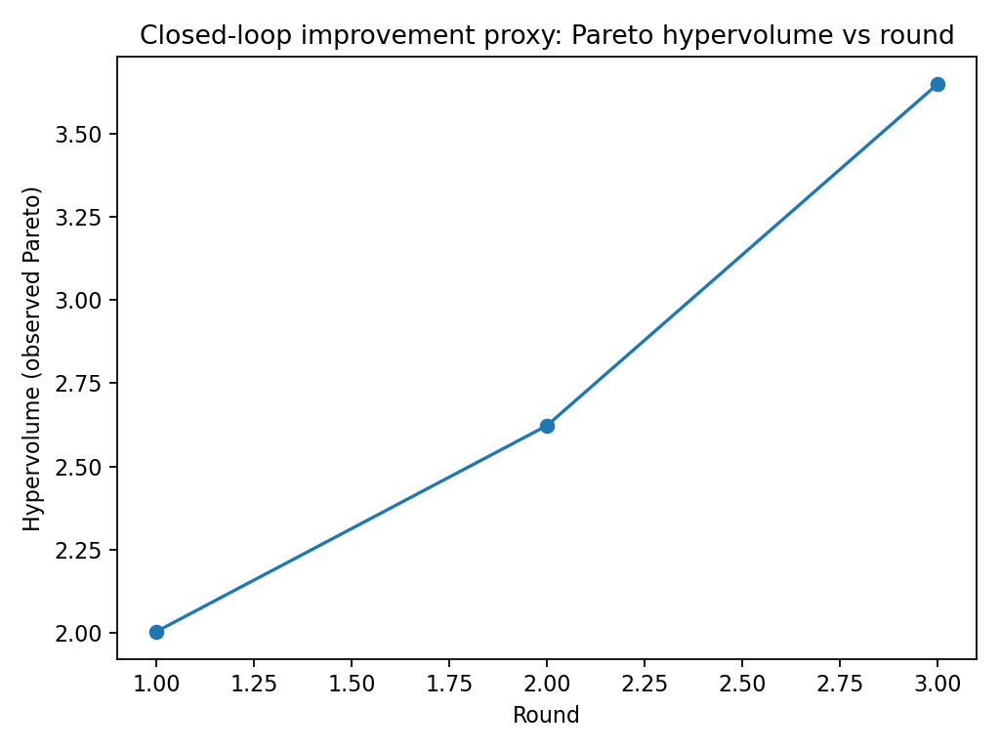
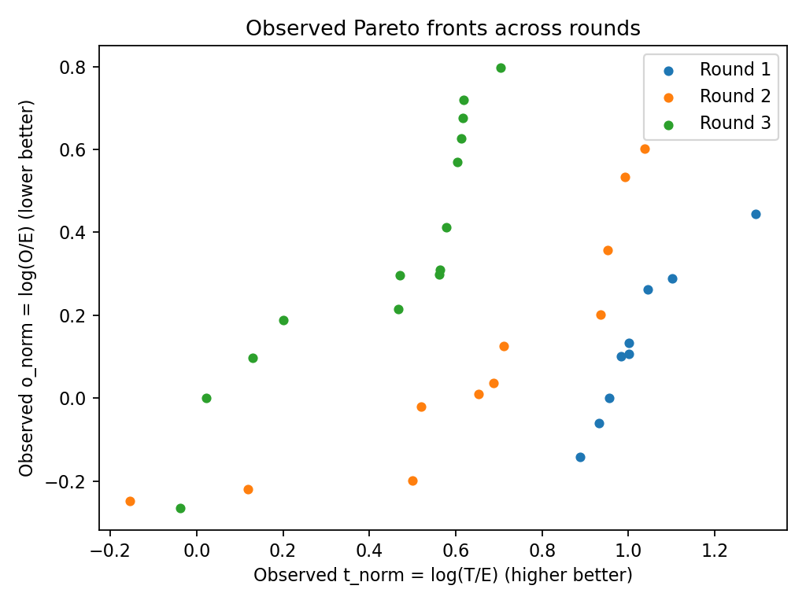

# Assay-Aware Closed-Loop Active Learning for Antibody Specificity Optimization

This repository implements a simulation framework for antibody-like sequence optimization under realistic yeast display counter-selection constraints. The system explicitly models assay physics, FACS gating, sequencing-based enrichment, and multi-objective optimization to demonstrate closed-loop improvement of the specificity Pareto frontier across rounds.

---

## Motivation

In real antibody engineering campaigns:

- Fluorescence signal depends on antigen concentration.
- Binding measurements are confounded by expression levels.
- FACS gating imposes hard selection bottlenecks.
- Counter-selection introduces a tradeoff between affinity and polyspecificity.
- Optimization must operate under assay-imposed constraints.

Most ML-based protein optimization frameworks ignore these dynamics.

This project explicitly models assay-aware selection and demonstrates that incorporating these constraints enables measurable expansion of the observed specificity frontier across iterative rounds.

---

## Problem Formulation

Each variant has latent properties:

- True affinity
- True stickiness (polyspecificity propensity)
- Stability (expression proxy)

Observed assay signals are generated as:

- `E ~ exp(stability + noise)`
- `T ~ E * f(affinity, antigen_concentration) + noise`
- `O ~ E * g(stickiness) + noise`

Antigen concentration decreases across rounds to simulate increasing stringency.

Optimization objectives are defined in expression-normalized space:

- `t_norm = log(T / E)`  (maximize)
- `o_norm = log(O / E)`  (minimize)

This mirrors real display campaigns where specificity must improve without conflating signal with expression.

---

## FACS Gating Model

Round 1 establishes absolute fluorescence thresholds based on quantiles:

- `E > e_thr`
- `T > t_thr`
- `O < o_thr`

These thresholds remain fixed in fluorescence space for subsequent rounds, with target threshold scaled proportionally to antigen concentration. This mimics real FACS practice where gates are designed once and applied consistently.

Sequencing counts are simulated pre- and post-sort to compute enrichment.

---

## Closed-Loop Active Learning

Each round performs:

1. Simulate assay readouts under current antigen concentration.
2. Apply fixed FACS gates.
3. Simulate sequencing counts and compute enrichment.
4. Train a bootstrap ensemble regressor on:
   - `y_tnorm`
   - `y_onorm`
   - `y_logE_expr`
   - `y_logE_enrich`
5. Predict mean and epistemic uncertainty on candidate pool.
6. Compute acquisition score:

   ```
   (t_norm - o_norm) + lambda * sigma
   ```

7. Enforce:
   - Expression feasibility constraint
   - Pareto filtering
   - Physicochemical diversity penalty
8. Select next batch.
9. Regrow next round pool as mixture of:
   - Gate-selected survivors
   - Model-proposed variants
   - Background diversity

This simulates a realistic design–build–test–learn loop.

---

## Multi-Objective Evaluation

To quantify optimization progress, we compute the 2D Pareto front in `(t_norm, o_norm)` space and evaluate the observed hypervolume using a dominated reference point.

Observed hypervolume increases monotonically:

- Round 1 → ~2.0  
- Round 2 → ~2.6  
- Round 3 → ~3.65  

This demonstrates measurable expansion of the specificity frontier under fixed gating constraints.

See:

- `results/al_pareto_fronts.png`
- `results/al_hypervolume.png`


---

## Representation and Modeling

Features:

- k-mer sequence features
- Physicochemical descriptors

Model:

- Bootstrap ensemble (Ridge regression)
- Mean prediction + ensemble standard deviation as uncertainty proxy

Acquisition:

- Multi-objective exploitation (`t_norm - o_norm`)
- Uncertainty-driven exploration
- Hard expression constraint
- Diversity enforcement in physicochemical space

---

## Outputs

The active learning loop generates:

- `results/al_gate_yields.png`
- `results/al_pareto_fronts.png`
- `results/al_hypervolume.png`
- `results/al_hypervolume.csv`
- Per-round:
  - Ensemble predictions
  - Selected sequences
  - Gate statistics

---

## Installation

Clone the repository:

```bash
git clone https://github.com/aradhana2515/specificity-driven-active-learning.git
cd specificity-driven-active-learning
```

## Create environment:

```
python -m venv .venv
source .venv/bin/activate
pip install -r requirements.txt
```

Or if using `pyproject.toml`:

```bash
pip install -e .
```

---

## Key Technical Contributions

- Explicit modeling of assay-dependent signal generation.
- Expression-normalized optimization objectives.
- Fixed fluorescence-space gating across rounds.
- Multi-objective acquisition with uncertainty integration.
- Closed-loop simulation with quantitative frontier tracking.
- Hypervolume-based evaluation of specificity improvement.

---

## Summary

This project demonstrates that incorporating assay physics and gating constraints into active learning materially affects optimization dynamics and produces measurable expansion of the specificity Pareto frontier across rounds.

It provides a structured foundation for integrating protein ML models into realistic antibody counter-selection workflows.

